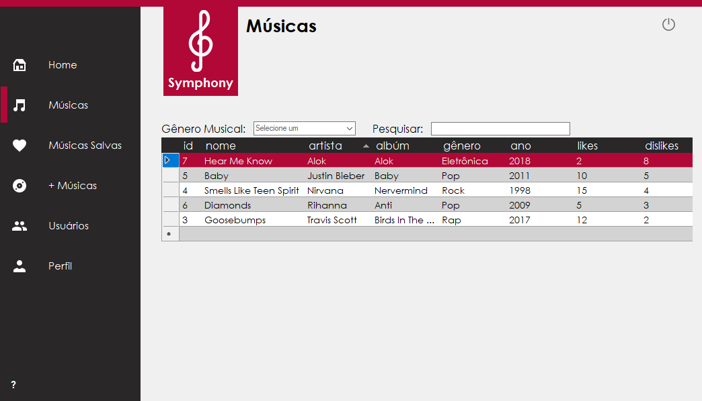
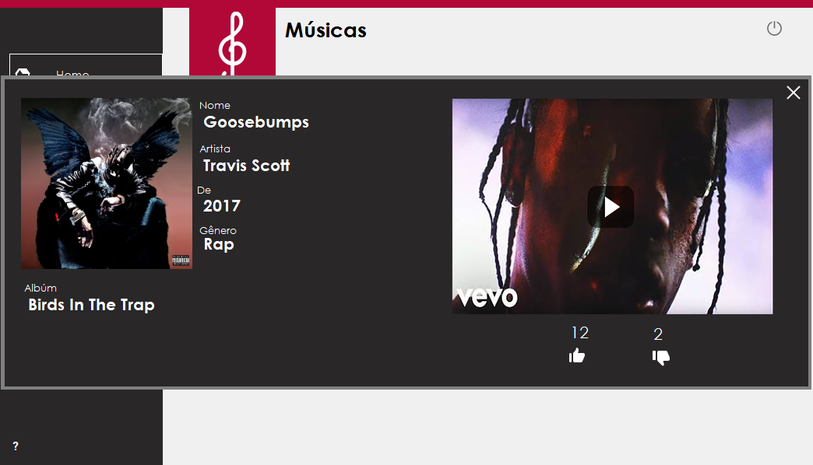
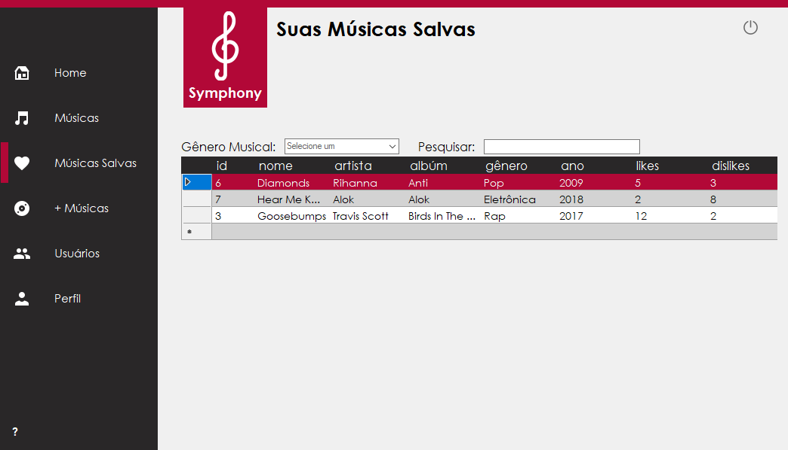
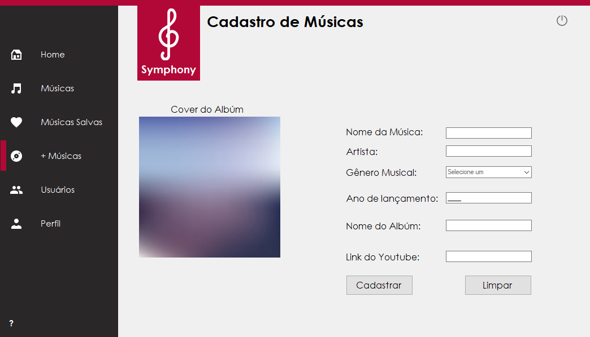
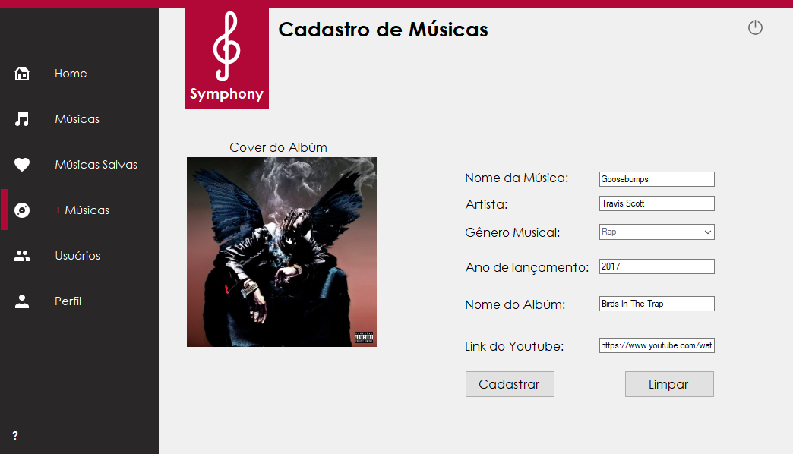
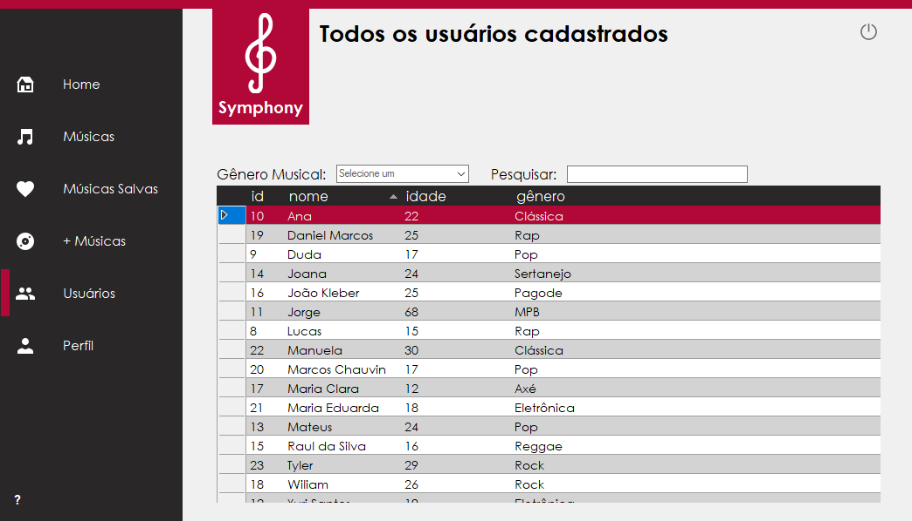
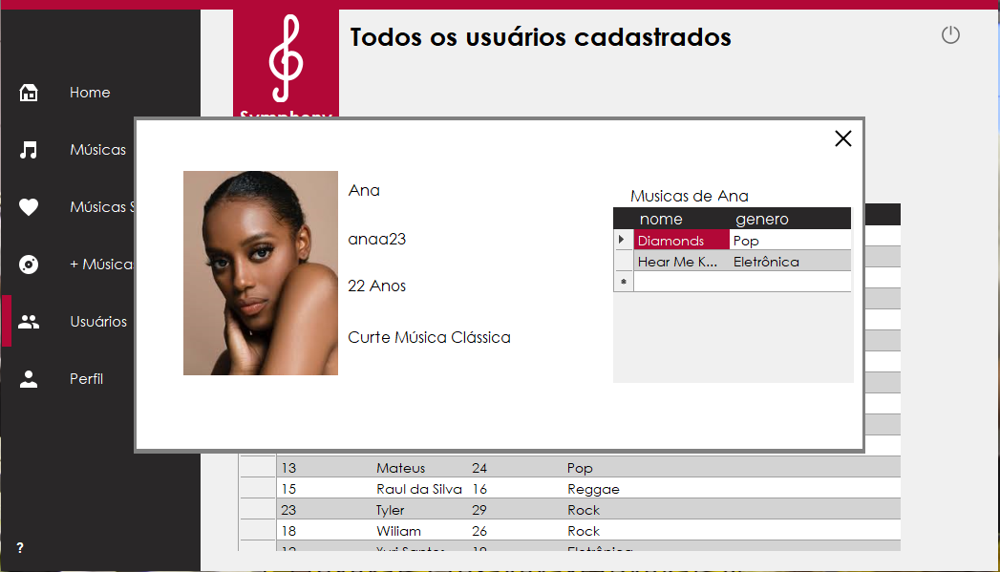
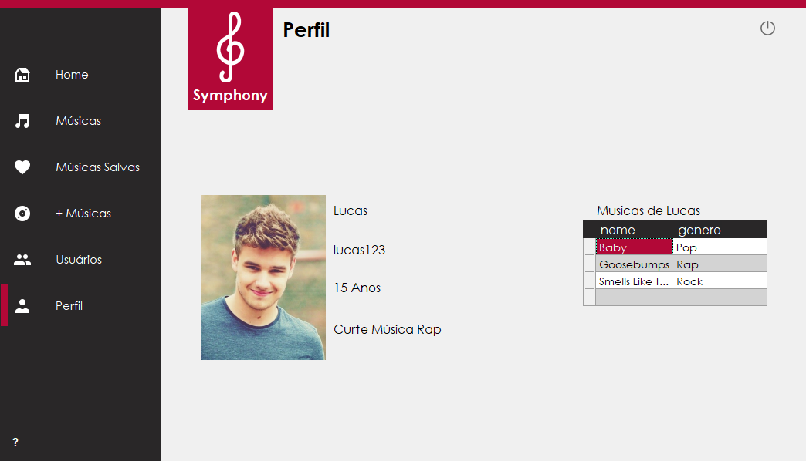

# Symphony
 
 Aplicação que simula uma rede social de músicas. Os usuários podem postar músicas, salvá-las, vizualizá-las, ouvi-las, dar like e deslike, ver outros usuários e suas músicas, entre outras features.  
  

## Tecnologias Utilizadas</h2>
 A aplicação foi feita na linguagem C#, utilizando um banco de dados PostgreSQL e um player de vídeos do Youtube.

## Sobre
 <b>Symphony</b> foi uma aplicação desenvolvida em 2018 para a disciplina de C#, ministrada no segundo ano do curso Técnino em Informática do <a href=https://cti.feb.unesp.br>CTI, o colégio técnico da Unesp Bauru</a>. 

## Features
 <h3>Login</h3>
  <figure><figcaption><b>Login no App</b></figcaption></figure>
 <h3>Cadastro</h3>
  <figure><figcaption><b>Cadastro de usuário</b></figcaption></figure>
 <h3>Tela Inicial</h3>
  <figure><figcaption><b>Tela Inicial do App</b></figcaption></figure>
 <h3>Músicas</h3>
   <figure><figcaption><b>Lista de todas músicas cadastradas</b></figcaption></figure>
 <h3>Música Específica</h3>  
   O usuário pode clicar duas vezes em alguma música da lista para abrir mais informações e um player do youtube. O usuário pode dar like ou deslike na música, caso dê like a música será salva em sua biblioteca.
   <figure><figcaption><b>Informações específicas da música e um player do Youtube da música</b></figcaption></figure>
 <h3>Músicas</h3>
    <figure><figcaption><b>Lista de todas músicas que o usuário deu like</b></figcaption></figure>
 <h3>Cadastro de Música</h3>
    <figure><figcaption><b>Cadastro de música</b></figcaption></figure>
    <figure><figcaption><b>Cadastro de música preenchido</b></figcaption></figure>  
 <h3>Usuários</h3>
    <figure><figcaption><b>Lista de todos os usuários cadastrados</b></figcaption></figure>
 <h3>Usuário Específico</h3>  
    O usuário pode clicar duas vezes em algum outro usuário e ver o perfil dele com suas informações e as músicas que esse cadastrou.
    <figure><figcaption><b>Perfil de outro usuário</b></figcaption></figure>
 <h3>Perfil</h3>
    <figure><figcaption><b>Perfil do usuário que está logado</b></figcaption></figure>   
 