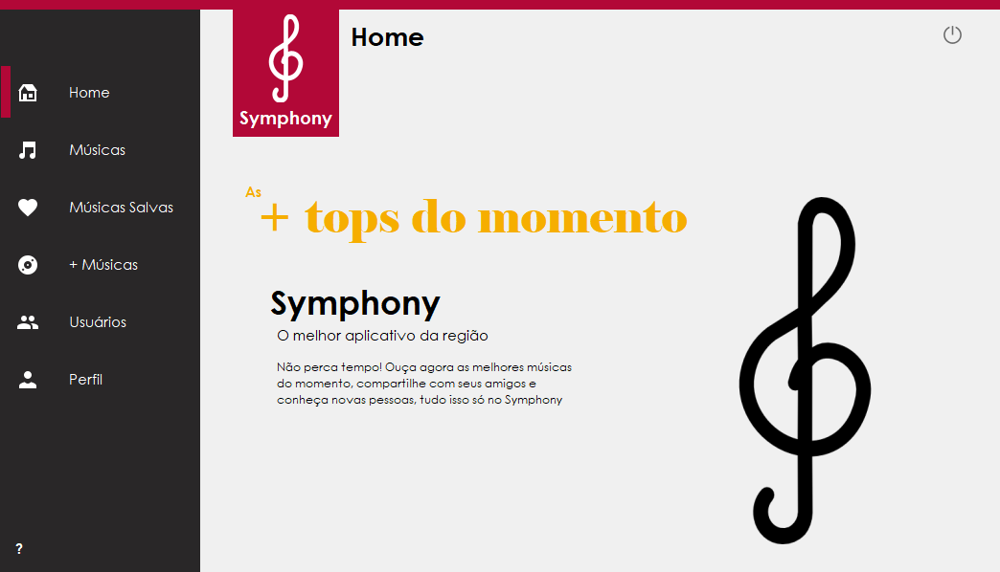
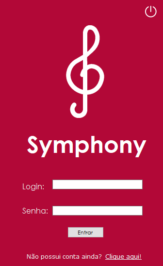
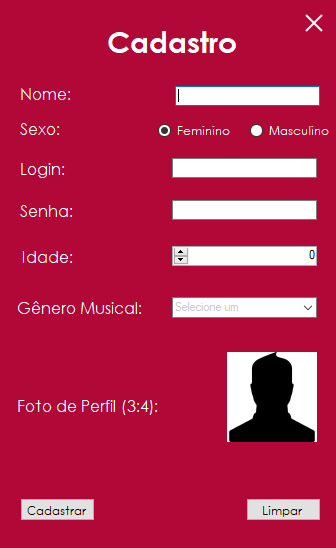

# Symphony
 
 Aplicação que simula uma rede social de músicas. Os usuários podem postar músicas, salvá-las, vizualizá-las, ouvi-las, dar like e deslike, ver outros usuários e suas músicas, entre outras features.  
 <figure><figcaption><b>Tela Inicial</b></figcaption></figure>

## Tecnologias Utilizadas</h2>
 A aplicação foi feita na linguagem C#, utilizando um banco de dados PostgreSQL e um player de vídeos do Youtube.

## Sobre
 <b>Symphony</b> foi uma aplicação desenvolvida em 2018 para a disciplina de C#, ministrada no segundo ano do curso Técnino em Informática do <a href=https://cti.feb.unesp.br>CTI, o colégio técnico da Unesp Bauru</a>. 

## Features
 <h3>Login</h3>
  <figure><figcaption><b>Login no App</b></figcaption></figure>
 <h3>Cadastro</h3>
  <figure><figcaption><b>Cadastro de usuário</b></figcaption></figure>
 <h3>Tela Inicial</h3>
                                                                                                                                    <figure><figcaption><b>Tela Inicial do App</b></figcaption></figure>